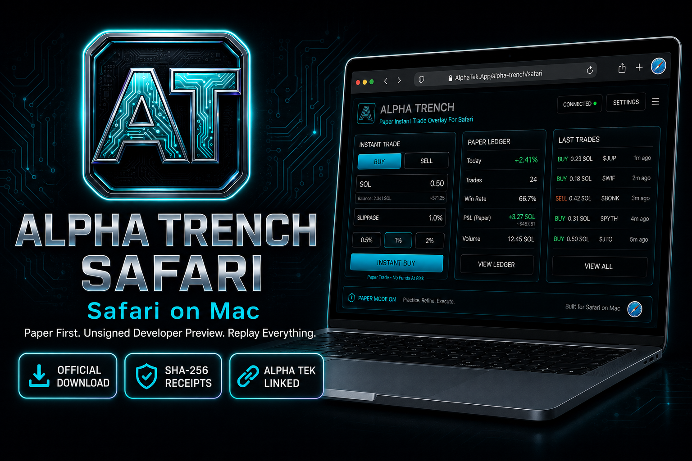
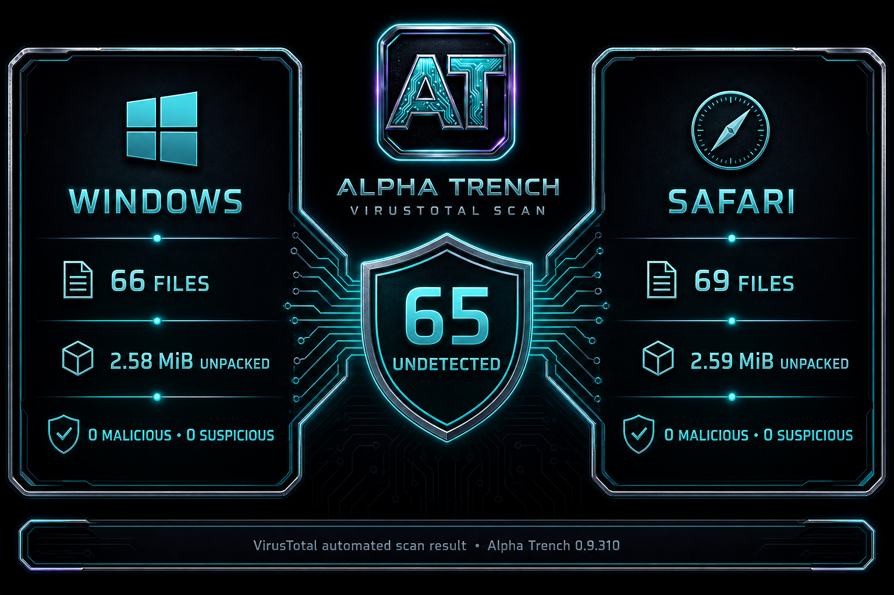

<!--
  PUBLIC product page — Alpha Trench on Safari (Mac).
  Packages are distributed through authenticated AlphaTek.App downloads.
-->

  

  <h1>Alpha Trench Safari</h1>

  

    <strong>The Alpha Tek trench client, packed for Safari on Mac.</strong> 
    Unsigned Developer Preview · Safari 18+ · Paper First · Same Product as Chrome
  

  

    Safari is the Mac install path. This repository is the
    <strong>Safari information, changelog, and support page</strong>. Development
    source remains private.
  

  

    
    &nbsp;
    
    &nbsp;
    
  

  

  <strong>Safari 0.9.310:</strong>
  <a href="https://www.virustotal.com/gui/file/062d514b36d29cbff053eb0b95e3d5353b78f3010e9d22cb3e676f3ef1eca7d1">Open the Public VirusTotal Report</a>
  · 0 malicious · 0 suspicious · 65 undetected

---

## Why a Separate Repo?

**Alpha Trench is one product.** Chrome and Safari are two **install paths**.

| Repo | Who It Is For |
|---|---|
| [AlphaTek.App/alpha-trench](https://www.AlphaTek.App/alpha-trench) | Windows / Chromium product and download page |
| **This Repo** | Safari documentation, changelog, screenshots, and support |

Development source remains private. Safari packages are delivered through an authenticated AlphaTek.App account download.

---

## What This Is (Honest)

- **Not** the Mac App Store listing yet
- **Not** a different trading engine
- Historical preview 0.9.239 was packed from the Chromium client
- Paper Instant Trade, Alpha Guard, Mint Intel, journal, **Trade Replay** (platform history when wallet linked)
- **Trench Cast / Market Replay / Wallet Replay** on [AlphaTek.App](https://www.alphatek.app) — web Theater
- **Music Lite is Chrome-only** (Safari has no `offscreen` documents)
- Mainnet Instant Trade stays **locked**

Historical versions through 0.9.239 retain MIT. Future releases are proprietary Alpha Tek packages.

Product updates and downloads live on [AlphaTek.App](https://www.AlphaTek.App/alpha-trench/safari).

---

## Hear The Pad

Product VO: [overlay-bumper.mp3](https://github.com/JohnnyxSmokes/alpha-trench/blob/main/assets/overlay-bumper.mp3) · live on [AlphaTek.App/alpha-trench/safari](https://www.AlphaTek.App/alpha-trench/safari)

## Download Alpha Trench for Safari

- **Official Safari Download:** [AlphaTek.App/alpha-trench/safari](https://www.AlphaTek.App/alpha-trench/safari)
- Sign in with your Alpha Tek account to receive the current package.
- **What Changed:** [CHANGELOG.md](CHANGELOG.md)

## Install (Unsigned / Temporary)

1. Sign in and download the Safari zip from [AlphaTek.App](https://www.AlphaTek.App/alpha-trench/safari), then unzip it.
2. Safari → Settings → **Advanced** → Show Features for Web Developers.
3. Safari → Settings → **Developer** → **Allow Unsigned Extensions** (Safari may turn this off after quit).
4. **Develop** menu → **Add Temporary Extension…** → select the folder that contains `manifest.json` (`unpacked`).
5. Settings → Extensions → enable **Alpha Trench for Safari**.
6. Open Axiom / Padre / Photon → toolbar icon → **Always Allow on This Website** → reload.

That last step is Safari’s permission model. The overlay will not inject until you allow the venue.

---

## Trust

| Check | Where |
|-------|--------|
| Package | Account-gated download from [AlphaTek.App](https://www.AlphaTek.App/alpha-trench/safari) |
| Integrity | Version and SHA-256 are returned with the official download |
| License | Historical releases through 0.9.239 retain MIT; future releases are proprietary |
| Windows / Chromium | [alpha-trench-windows](https://github.com/JohnnyxSmokes/alpha-trench-windows) |

Never paste a seed phrase into the extension. Paper first. Mainnet Instant Trade stays locked until armed.

---

## Linked Alpha Tek Intelligence

When linked to AlphaTek.App, the Safari client can request source-aware Pump ecosystem context reconciled from PumpPortal WebSocket, Frontend V3 REST, and FluxBeam WebSocket/Moralis fallback. Pump.fun and BONK/Raydium provenance stays labeled and selectable.

---

## Trench Replay Stack (Web + Extension)

Alpha Tek ships the **most tech-packed replay stack on Solana** — not a chart embed bolt-on.

| Mode | Surface |
|------|---------|
| **Market Replay** | Any token on [AlphaTek.App](https://www.alphatek.app) |
| **Trench Theater** | [alphatek.app/dashboard/alpha-replay](https://www.alphatek.app/dashboard/alpha-replay) — Cast, Forecast, drawings |
| **Trade Replay** | Alpha Trench extension dashboard (linked wallet) |

Full marketing reference: [TRENCH_REPLAY_STACK.md](https://github.com/JohnnyxSmokes/alpha-trench/blob/main/TRENCH_REPLAY_STACK.md) (on the alpha-trench repo when published).

---

## Ecosystem

| Plane | Link |
|-------|------|
| **Safari Package** | [AlphaTek.App/alpha-trench/safari](https://www.AlphaTek.App/alpha-trench/safari) |
| **Windows** | [alpha-trench-windows](https://github.com/JohnnyxSmokes/alpha-trench-windows) |
| **Portal** | [alphatek.app](https://www.alphatek.app) |
| **Discord** | [discord.gg/epicalpha](https://discord.gg/epicalpha) |
